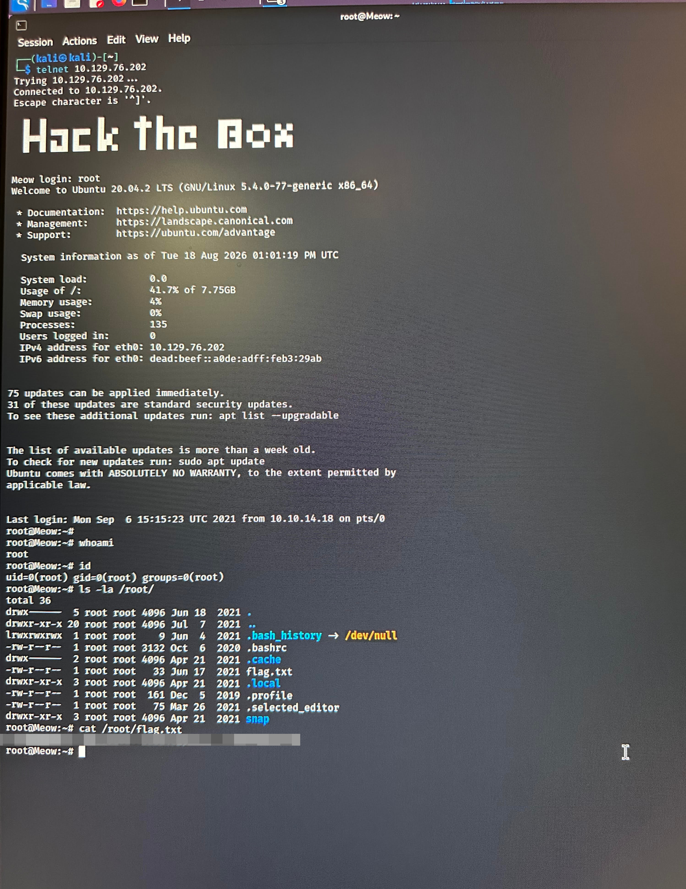

# Linux Privilege Escalation Assessment
## Overview

This project documents a controlled penetration testing assessment of a Linux system, focusing on reconnaissance, enumeration, initial access, and privilege escalation to root.

## Assessment Objectives

- Identify exposed services and potential attack vectors.
- Enumerate the target Linux system.
- Obtain initial access through an identified weakness.
- Perform privilege escalation.
- Achieve and verify root-level access.

 ## Environment

- Target OS: Linux
- Testing Environment: Authorized cybersecurity training lab
- Attacker Machine: Kali Linux
- Assessment Type: Black-box penetration testing

 ## Reconnaissance & Enumeration

The assessment began with network reconnaissance and service enumeration to identify the target system, exposed ports, running services, and potential attack vectors.

### Tools Used

- Nmap
- Kali Linux
- Linux command-line utilities

 ## Initial Access

After identifying the exposed services, further enumeration was performed to determine potential weaknesses and obtain initial access to the target system.

Successful access provided a limited user shell, which was then used for local system enumeration.

## Privilege Escalation

Local enumeration was performed after gaining initial access to identify potential privilege escalation paths.

A security weakness was identified and successfully leveraged to escalate privileges from a limited user account to root-level access.

Root access was verified using:

`whoami`

`id`

## Skills Demonstrated

- Network reconnaissance and service enumeration
- Linux system enumeration
- Vulnerability identification
- Initial access techniques
- Linux privilege escalation
- Root access verification
- Penetration testing methodology

 ## Key Takeaways

This assessment strengthened my practical understanding of the penetration testing lifecycle, from initial reconnaissance and enumeration to system access and privilege escalation.

The exercise also reinforced the importance of systematic enumeration and validating security weaknesses before attempting exploitation.

## Root Access Verification

The screenshot below demonstrates successful root-level access obtained during the authorized security assessment. The flag value has been intentionally redacted.

